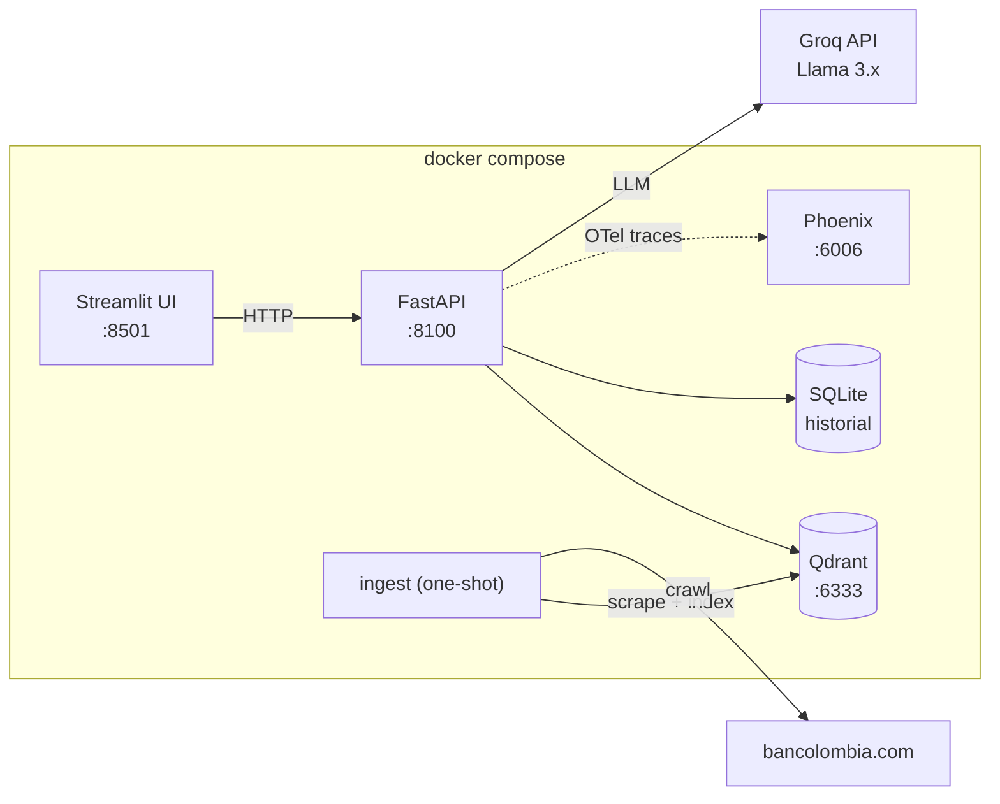

# 🏦 Bank RAG Assistant

Asistente conversacional **RAG (Retrieval-Augmented Generation)** que scrapea el
sitio público de un banco, indexa su contenido en una base vectorial y responde
preguntas en español con citas a las páginas fuente — con historial de
conversación persistente por sesión, analítica de uso y trazabilidad completa
de cada respuesta.

**100% herramientas gratuitas**: modelos open source locales, Qdrant
self-hosted, Groq free tier y Phoenix self-hosted. Costo de operación: **$0**.

> **Sitio objetivo: [bancolombia.com](https://www.bancolombia.com/)**. La prueba
> nombra a BBVA Colombia pero permite otro banco: `bbva.com.co` devuelve
> HTTP 403 a cualquier cliente no-navegador (protección anti-bot a nivel de
> CDN/TLS, verificado el 2026-07-04), mientras que el sitio de Bancolombia se
> sirve renderizado desde el servidor. La decisión completa está en
> [SPEC.md](SPEC.md), el documento de diseño previo a la implementación.

---

## Arquitectura



**Flujo de una pregunta:** UI → `POST /chat` → carga de los últimos N mensajes
de la sesión → *condensación* de la pregunta (un modelo pequeño la reescribe
como consulta autónoma si es un seguimiento) → búsqueda vectorial (top-k) →
*reranking* con cross-encoder y umbral de relevancia → armado del prompt
(sistema + historial + contexto citado) → Groq → persistencia de ambos turnos
con tokens y latencia → respuesta con fuentes. Si ningún fragmento supera el
umbral, el sistema responde honestamente que no tiene la información **sin
llamar al LLM** y lo registra para la métrica de cobertura.

## Requisitos previos

- **Docker** y **Docker Compose** (v2). Es lo único obligatorio.
- Una **API key gratuita de Groq**: crearla en
  [console.groq.com](https://console.groq.com) (no requiere tarjeta).
- ~4 GB de disco para imágenes y modelos; los modelos de embeddings/reranking
  (~250 MB) se descargan automáticamente al primer arranque y quedan cacheados
  en un volumen.

## Puesta en marcha

```bash
# 1. Clonar
git clone https://github.com/pajaravag/bank-rag-assistant.git
cd bank-rag-assistant

# 2. Configurar el entorno
cp .env.example .env
# Editar .env y poner tu GROQ_API_KEY

# 3. Levantar todos los servicios (Qdrant, API, UI, Phoenix)
docker compose up -d --build

# 4. Poblar el índice: scrapea el sitio y lo indexa (una sola vez, ~5 min)
docker compose run --rm ingest
```

| Servicio | URL | Descripción |
|---|---|---|
| **Chat / Analítica** | http://localhost:8501 | Interfaz conversacional (Streamlit) |
| **API** | http://localhost:8100/docs | OpenAPI interactiva (FastAPI) |
| **Phoenix** | http://localhost:6006 | Trazas de cada respuesta (observabilidad) |
| **Qdrant** | http://localhost:6333/dashboard | Dashboard de la base vectorial |

Los datos scrapeados quedan visibles en `./data/raw/` (HTML crudo + manifest) y
`./data/clean/` (JSON limpio por página); el historial en `./data/history.db`.

## Uso de la interfaz

1. Abre http://localhost:8501 — se crea una sesión automáticamente (el ID es
   visible en la barra lateral; puedes crear una nueva o retomar una anterior).
2. Pregunta en español sobre el contenido del sitio: productos, cuentas,
   créditos, factoring, etc. Cada respuesta incluye un desplegable **Fuentes**
   con las páginas citadas y la latencia.
3. Los seguimientos funcionan con memoria: *"¿Y qué requisitos piden para
   solicitarlo?"* se resuelve contra los N mensajes anteriores (N configurable).
4. La vista **📊 Analítica** muestra las métricas del histórico completo.
5. En **Phoenix** (http://localhost:6006) puedes ver la traza de cada turno:
   condensación → recuperación (documentos y scores) → generación (modelo y
   tokens).

También puedes usar la API directamente:

```bash
curl -X POST http://localhost:8100/chat \
  -H "Content-Type: application/json" \
  -d '{"session_id": "mi-sesion", "message": "¿Qué es el factoring?"}'

curl http://localhost:8100/sessions/mi-sesion/history
curl http://localhost:8100/analytics/summary
```

## Analítica del histórico de conversaciones

`GET /analytics/summary` (y la vista Analítica) recorre todo el historial
persistido y produce métricas de uso e impacto:

- **Volumen y engagement**: sesiones, mensajes, promedio de mensajes por sesión,
  mensajes por día, sesiones más activas.
- **Rendimiento**: latencia promedio, p50 y p95.
- **Cobertura** *(métrica de impacto)*: % de preguntas que el corpus pudo
  responder y las preguntas recientes sin respuesta — le dice al banco qué
  contenido falta en su sitio.
- **Tokens y costo** *(métrica de impacto)*: consumo total de tokens, costo real
  ($0 en Groq free tier) y el costo equivalente si se usara una API de pago
  (referencia GPT-4o) — cuantifica el ahorro del stack gratuito.
- **Contenido**: páginas más citadas y temas más preguntados (frecuencia de
  términos con filtro de stopwords en español).

## Patrones de diseño

| Patrón | Tipo | Dónde | Por qué |
|---|---|---|---|
| **Factory** | Creacional | [`src/llm/factory.py`](src/llm/factory.py) — `LLMProviderFactory` construye el proveedor LLM desde configuración, con registro extensible | Desacopla el sistema del vendor: agregar Ollama u OpenAI es un `register()` + un cambio de `.env`, sin tocar código consumidor. También habilita el *fallback* de modelo ante rate limits |
| **Strategy** | Comportamental | [`src/retrieval/strategies.py`](src/retrieval/strategies.py) — `RetrievalStrategy` con `SimilaritySearch` y `RerankedSearch`, seleccionadas por `RERANK_ENABLED` | El servicio de chat depende de la interfaz, no de la técnica de recuperación; activar/desactivar el reranker o añadir búsqueda híbrida no toca la lógica de negocio |
| **Repository** | Estructural | [`src/repositories/`](src/repositories/) — `VectorRepository` (Qdrant) y `ConversationRepository` (SQLite) | La persistencia queda detrás de interfaces: cambiar Qdrant por otro motor o SQLite por Postgres reimplementa una clase; además hace el dominio testeable sin infraestructura |
| **Singleton** (vía `lru_cache`) | Creacional | [`src/config.py`](src/config.py) — `get_settings()` cachea la instancia única de configuración | Una sola fuente de verdad de configuración validada (pydantic) compartida por toda la aplicación, sin estado global mutable |

Los cuatro patrones son estructurales al sistema (no decorativos): el Factory
resuelve el fallback de modelos, el Strategy resuelve el bonus de reranking, y
los Repository aíslan las dos persistencias reales del proyecto.

## Stack tecnológico y justificación

| Componente | Elección | Justificación |
|---|---|---|
| Scraping | `httpx` + `BeautifulSoup4` | El sitio se sirve server-side; un crawler BFS ligero con respeto de `robots.txt` y delays es suficiente — sin el peso de un navegador headless |
| Base vectorial | **Qdrant** (self-hosted) | Open source, gratuita, primera clase en Docker y con dashboard propio; corre como servicio real en compose |
| Embeddings | `intfloat/multilingual-e5-small` | Gratuito, local, multilingüe (el contenido es en español), 384 dims, corre bien en CPU. Se aplican los prefijos `query:`/`passage:` que la familia e5 exige |
| Reranker | `cross-encoder/mmarco-mMiniLMv2-L12-H384-v1` | Cross-encoder multilingüe pequeño; re-puntúa (pregunta, fragmento) con mucha más precisión que la similitud coseno y habilita el umbral de relevancia |
| LLM | **Groq** (Llama 3.3 70B, fallback 3.1 8B) | Free tier sin tarjeta, inferencia muy rápida, modelos open-weight. Abstraído tras el Factory: el sistema no depende del vendor |
| Orquestación | **Python puro** (sin LangChain) | Pipeline propio: control total, menos dependencias y patrones de diseño genuinos y visibles en lugar de enterrados en un framework |
| Backend | **FastAPI** | API-first: la UI es un cliente delgado; validación pydantic, OpenAPI gratis, manejo de errores por capas |
| UI | **Streamlit** | Chat funcional y limpio con mínimo esfuerzo, como pide la prueba |
| Historial | **SQLite** | Persistente, cero servicios extra, y el recorrido analítico es SQL trivial |
| Observabilidad | **Arize Phoenix** (self-hosted) + OpenTelemetry | Trazas del pipeline completo visibles por el evaluador sin cuentas ni keys; apagable por configuración |
| Config | `pydantic-settings` + `.env` | Todos los parámetros externalizados y tipados (N de historial, chunk size, top-k, umbrales, modelos) |
| Contenedores | Dockerfile único + compose multi-servicio | Un solo comando levanta todo; torch CPU-only para una imagen razonable |

## Estructura del proyecto

```
├── docker-compose.yml      # qdrant + api + ui + phoenix + ingest (perfil)
├── Dockerfile
├── SPEC.md                 # diseño previo a la implementación (SDD)
├── src/
│   ├── config.py           # settings tipados desde .env (Singleton)
│   ├── models.py           # contratos de datos compartidos
│   ├── observability.py    # OTel -> Phoenix (opcional)
│   ├── scraper/            # crawler BFS + limpieza (crudo y limpio en local)
│   ├── ingestion/          # chunking + embeddings + indexación
│   ├── retrieval/          # estrategias + reranker (Strategy)
│   ├── llm/                # interfaz + Groq + factory (Factory)
│   ├── repositories/       # Qdrant y SQLite (Repository)
│   ├── services/           # orquestación del chat (condensación, gating)
│   ├── analytics/          # métricas del histórico
│   ├── api/                # endpoints FastAPI
│   └── ui/                 # app Streamlit
└── tests/                  # 29 tests unitarios y de API
```

## Tests

```bash
# Local (requiere venv con dependencias) o dentro del contenedor:
docker compose run --rm --no-deps api python -m pytest tests/ -q
```

29 tests cubren chunking, ventana de historial, aislamiento de sesiones,
analítica, deduplicación y umbrales de recuperación, factory y endpoints de la
API (incluidos los caminos de error 404/422/503). Hay un workflow de GitHub
Actions que los ejecuta en cada push.

## Limitaciones conocidas y decisiones relevantes

- **Cambio de sitio objetivo**: BBVA Colombia bloquea clientes no-navegador
  (403 a nivel CDN). La prueba permite otro banco; se eligió Bancolombia y se
  documentó la verificación. Superarlo habría requerido un navegador headless
  y técnicas anti-detección, inapropiadas para una prueba.
- **Alcance del scraping**: hasta `SCRAPE_MAX_PAGES` (150) páginas HTML del
  dominio, respetando `robots.txt`, sin contenido tras login ni PDFs.
- **Sin autenticación ni rate limiting en la API**: es un asistente interno de
  demostración; en producción iría detrás de un gateway con SSO.
- **Sin streaming de respuestas**: la respuesta llega completa (1–5 s). SSE
  está listado en mejoras futuras.
- **SQLite mononodo**: suficiente para la escala de la prueba; la interfaz
  Repository permite migrar a Postgres sin tocar el dominio.
- **El condensador puede fallar**: si el modelo pequeño reescribe mal la
  pregunta, hay guardas (longitud, formato) que caen a la pregunta original —
  el peor caso es la calidad de recuperación de un RAG sin condensación.
- **La calidad depende del contenido del sitio**: páginas comerciales tienen
  poco detalle (tasas, requisitos); la métrica de cobertura expone exactamente
  esos vacíos.

## Futuras mejoras

- Streaming de respuestas (SSE) hacia la UI.
- Búsqueda híbrida (BM25 + vectorial) y expansión de consultas.
- Embeddings vía ONNX (`fastembed`) para eliminar torch y reducir la imagen ~1.5 GB.
- Scraping incremental programado (detectar páginas nuevas/cambiadas por hash).
- Evaluación automática de calidad RAG (RAGAS o el módulo de evals de Phoenix)
  sobre un golden set de preguntas.
- Proveedor Ollama registrado en el Factory para operación 100% offline.
- Postgres + pgvector como alternativa de un solo motor para historial y vectores.
- Autenticación (API key / OIDC) y rate limiting por sesión.

## Licencia

[MIT](LICENSE)
