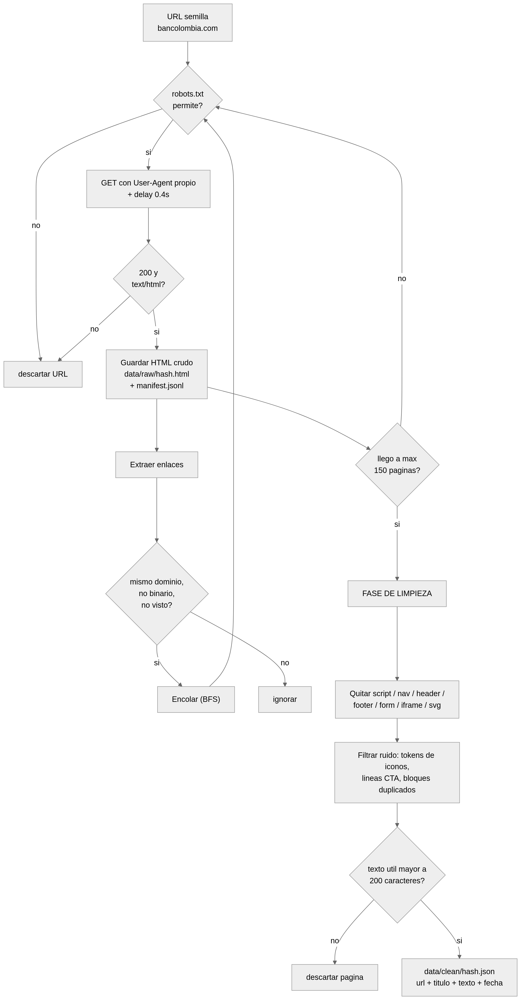
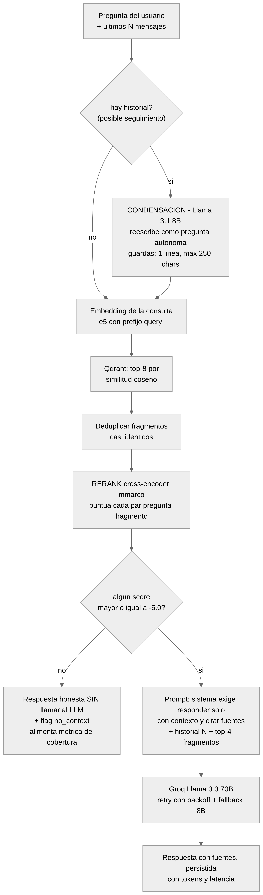
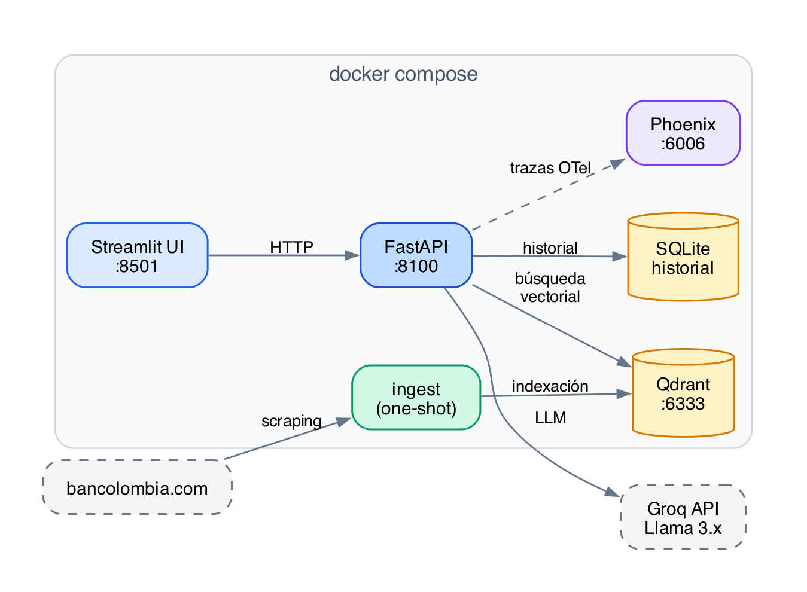

# Proceso de Scraping y Razonamiento del Retrieval

Este documento explica, con diagramas y **datos reales del proyecto**, cómo se
construye el corpus (scraping + limpieza) y cómo razona el sistema para
responder cada pregunta (retrieval + generación).

---

## 1. Proceso de scraping



### 1.1 Rastreo (crawl)

El crawler ([`src/scraper/fetcher.py`](../src/scraper/fetcher.py)) hace un
recorrido **BFS (breadth-first)** desde `https://www.bancolombia.com/`:

1. **`robots.txt` primero**: se descarga y parsea antes de tocar cualquier
   página; toda URL no permitida se descarta.
2. **Peticiones educadas**: User-Agent propio identificable
   (`bank-rag-assistant/0.1 (+repo)`), delay de 0.4 s entre peticiones y
   timeout de 15 s.
3. **Filtros de frontera**: solo URLs del mismo dominio, se descartan binarios
   (PDF, imágenes, JS/CSS...) por extensión y solo se persisten respuestas
   `200` con `content-type: text/html`.
4. **Almacenamiento crudo (requisito FR2)**: cada página se guarda tal cual en
   `data/raw/{hash_sha256_url}.html` y se registra una línea en
   `data/raw/manifest.jsonl`:

```json
{"url": "https://www.bancolombia.com/personas", "status": 200,
 "path": "data/raw/6f65b0af8419dd1c.html", "fetched_at": "2026-07-04T21:50:12"}
```

5. **Parada**: al alcanzar `SCRAPE_MAX_PAGES` (150 por defecto, configurable
   por `.env`).

**Resultado real**: 150 páginas HTML crudas en ~4 minutos, cero bloqueos del
sitio (el respeto de robots.txt y el delay evitan el rate-limiting).

> **Decisión documentada**: la prueba nombra a BBVA Colombia, pero
> `bbva.com.co` devuelve **HTTP 403 a cualquier cliente no-navegador**
> (protección anti-bot a nivel CDN/TLS — se verificó con headers completos de
> Chrome el 2026-07-04). La prueba permite otro banco; Bancolombia se sirve
> server-side rendered y es scrapeable con HTTP plano.

### 1.2 Limpieza

El limpiador ([`src/scraper/cleaner.py`](../src/scraper/cleaner.py)) convierte
cada HTML crudo en un documento de texto útil:

| Paso | Qué elimina | Ejemplo real del sitio |
|---|---|---|
| Tags de boilerplate | `script`, `nav`, `header`, `footer`, `form`, `iframe`, `svg` | menús de navegación, píe legal |
| Tokens de iconos | líneas kebab-case de fuentes de iconos | `angle-right-small`, `arrow-down` |
| Líneas CTA puras | llamados a la acción sin información | `Conocer más`, `Ver más` |
| Bloques repetidos | los carruseles duplican secciones enteras en el DOM | campañas repetidas 2–3 veces |
| Páginas vacías | menos de 200 caracteres útiles tras limpiar | páginas de redirección |

El resultado va a `data/clean/{hash}.json` con `{url, title, text, fetched_at}`.

**Impacto medible de la limpieza**: el mismo crawl de 150 páginas produce
**1.133 chunks sin los filtros de ruido vs. 1.032 con ellos (−9 %)** — ese 9 %
era ruido que competía en el retrieval contra contenido real.

### 1.3 Indexación

([`src/ingestion/`](../src/ingestion/)) Cada documento limpio se trocea con un
chunker consciente de párrafos (800 caracteres, solapamiento de 120), se
vectoriza con `multilingual-e5-small` (prefijo `passage:`, vectores
normalizados de 384 dims) y se inserta en Qdrant con **IDs deterministas**
(`uuid5(url + chunk_index)`), de modo que re-ejecutar la ingesta actualiza en
lugar de duplicar.

---

## 2. Razonamiento del retrieval



Cada pregunta pasa por un pipeline de decisiones. Lo que sigue son **casos
reales** ejecutados contra el corpus indexado.

### 2.1 Condensación de la consulta (seguimientos)

El texto de un seguimiento no sirve para buscar: *"¿Y qué requisitos piden
para solicitarlo?"* no se parece vectorialmente a nada sobre créditos. Antes
de buscar, un modelo pequeño y rápido (Llama 3.1 8B) reescribe la pregunta
usando el historial:

```
Entrada : ¿Y qué requisitos piden para solicitarlo?
Historial: [conversación previa sobre crédito de vivienda]
Salida  : ¿Qué requisitos pide el banco para solicitar el crédito de vivienda?
```

La salida tiene **guardas**: debe ser una sola línea de tamaño de pregunta
(≤ 250 caracteres); si el modelo intenta *responder* en lugar de *reescribir*
(le pasó al 8B durante el desarrollo), se descarta y se busca con la pregunta
original. La respuesta al usuario siempre usa la pregunta original — la
condensación solo alimenta al buscador.

### 2.2 Búsqueda vectorial + deduplicación

La consulta condensada se vectoriza (prefijo `query:` — la familia e5 es
asimétrica y omitirlo degrada el recall) y Qdrant devuelve los **top-8** por
similitud coseno. Fragmentos casi idénticos (bloques repetidos entre páginas)
se deduplican por hash del texto normalizado.

### 2.3 Reranking con cross-encoder

La similitud coseno es rápida pero gruesa: compara la pregunta y el fragmento
por separado. El **cross-encoder** (`mmarco-mMiniLMv2`) lee cada par
(pregunta, fragmento) junto y produce un score mucho más discriminante.
Scores reales sobre el corpus:

| Consulta | Scores top-6 tras rerank | Lectura |
|---|---|---|
| *¿Qué requisitos piden para solicitar un crédito de vivienda?* | **+2.54, +0.16**, −1.36, −3.09, −3.54, −3.76 | señal clara: hay contenido que responde |
| *¿Qué es el factoring?* | −2.80, −3.56, −4.05, −4.05, −4.42, −4.92 | contenido relevante pero menos directo |
| *¿Cuál es la receta de la paella valenciana?* | −7.53, −7.71, −7.97, −8.24, −8.41, −8.57 | el corpus no puede responder |

### 2.4 Umbral de relevancia (gating)

Con esa distribución se fijó el umbral `RERANK_SCORE_THRESHOLD = −5.0`
(configurable): separa limpiamente lo respondible (≥ −3.8 en la práctica) de
lo no respondible (≤ −7.5). Si **ningún** fragmento supera el umbral:

- Se responde honestamente que el sitio no cubre el tema — **sin llamar al
  LLM** (cero tokens gastados en preguntas sin respuesta).
- Se persiste el flag `no_context`, que alimenta la **métrica de cobertura**
  de la analítica: qué % de preguntas pudo responder el corpus y cuáles no —
  información accionable sobre qué contenido falta en el sitio.

La defensa es de **dos capas**: si contenido semánticamente cercano pero
insuficiente supera el umbral (p. ej. el sitio sí habla de fútbol por
patrocinios), el prompt del sistema — "responde exclusivamente con el
contexto, nunca inventes" — hace que el LLM decline con honestidad.

### 2.5 Generación y persistencia

Los top-4 fragmentos que sobreviven se numeran con su título y URL y se
inyectan en el prompt junto con el historial (últimos N mensajes, N
configurable). Groq (Llama 3.3 70B) genera la respuesta citando páginas; ante
rate-limit hay reintentos con backoff exponencial y fallback automático al
8B. Ambos turnos se persisten con fuentes, latencia, tokens y modelo.

### 2.6 Observabilidad del razonamiento

Todo el razonamiento anterior es **visible por turno** en Phoenix
(`http://localhost:6006`): cada pregunta genera una traza
`chat → condense_query → retrieve → generate` con la consulta condensada, las
URLs y scores recuperados, el modelo usado y los tokens consumidos. Es la
herramienta para depurar por qué el sistema respondió (o no) una pregunta.

---

## Arquitectura general



Los diagramas de este documento se regeneran con
`python docs/render_diagrams.py` (requiere [Graphviz](https://graphviz.org/):
`brew install graphviz` en macOS o `apt-get install graphviz` en Debian/Ubuntu).
